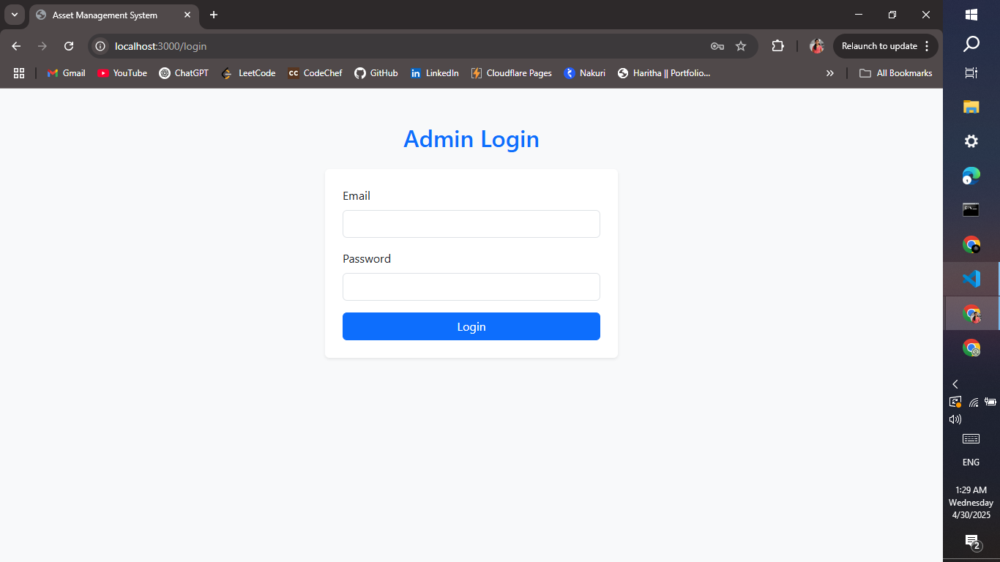
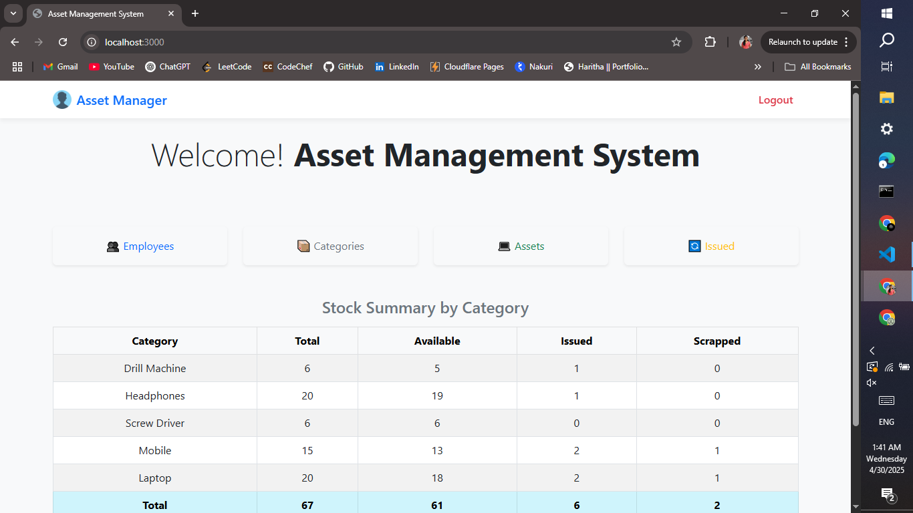
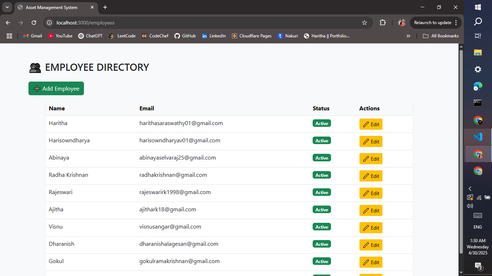
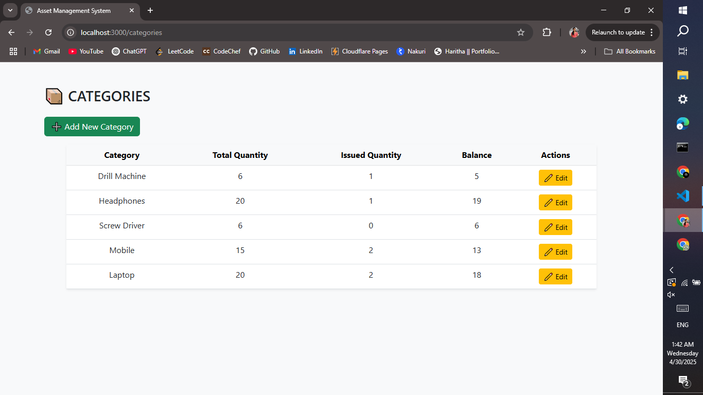
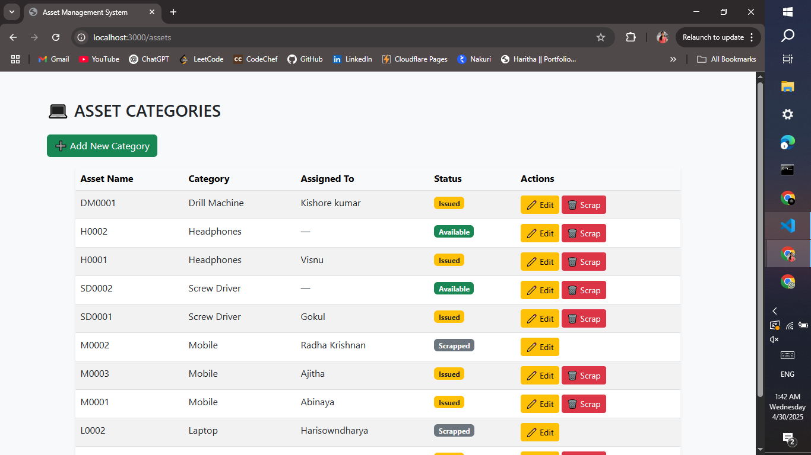
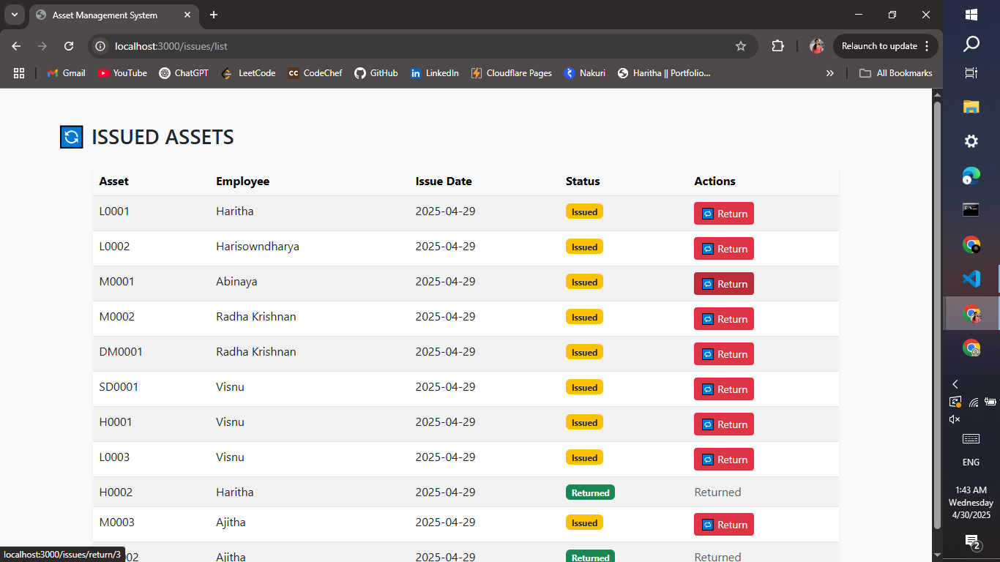
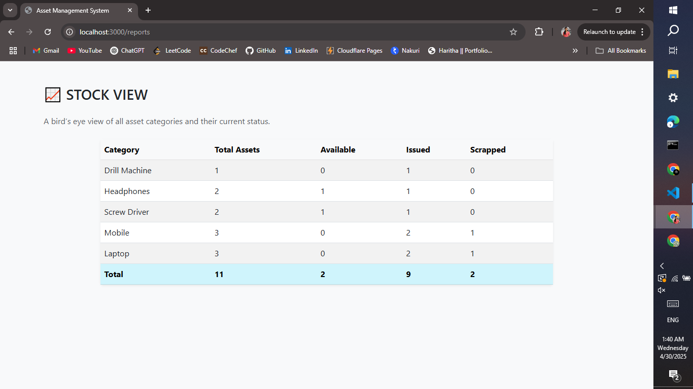

# 📦 Asset Management System

A web-based platform to manage employees, categories, assets, and asset issuance in an organization. Built using Node.js, Express, Sequelize ORM, PostgreSQL, and Pug templating engine.

---

## 🚀 Features

- 👤 Admin Login
- 👥 Employee Management (Add, Edit, View)
- 📦 Category Management (Track total, issued, balance quantities)
- 💻 Asset Management (Add, Assign, Scrap assets)
- 🔄 Issue & Return Tracking (Maintain history of issued/returned assets)
- 📊 Stock Reports (Category-wise summary)
- 🔐 Session-based Authentication
- 🌐 Responsive UI using Bootstrap 5

---

## 📁 Project Structure
├───config
├───controllers
├───models
├───public
   └───css
├───routes
└───views
    ├───assets
    ├───auth
    ├───categories
    ├───employees
    ├───issues
    └───report
├───.env

---

## 🛠️ Setup Instructions

### 1. Clone the repository

git clone https://github.com/harithasaraswathyrk/Asset_Management_System

### 2. Install dependencies

npm install

### 3. Create .env file

PORT=3000 
DB_NAME=your_db_name 
DB_USER=your_postgres_user 
DB_PASSWORD=your_postgres_password 
DB_HOST=localhost

### 4. Set up PostgreSQL

- Create a database in PostgreSQL matching DB_NAME
- Make sure PostgreSQL is running on the correct port

### 5. Sync & Run Server

npx nodemon app.js

Then open in your browser:  
http://localhost:3000

---

## 📝 Key Pages

| Page           | URL                | Description                            |
|----------------|--------------------|----------------------------------------|
| Login          | /login             | Admin login                            |
| Home           | /                  | Dashboard + Stock summary              |
| Employees      | /employees         | List and manage employees              |
| Categories     | /categories        | List and manage asset categories       |
| Assets         | /assets            | List, assign or scrap assets           |
| Issued Assets  | /issues/list       | View issued assets and return them     |
| Reports        | /reports           | Overall asset/categorization summary   |

---

## 📸 Screenshots

### 🤵 Admin Login Page

### 🏠 Home Dashboard

### 👥 Employees Page

### 📦 Category Page

### 💻 Asset Page

### 🔄 Issue Asset Page

### 📊 Report Page

---

## 💅 UI Tech

- Bootstrap 5
- Custom CSS (light, clean theme)
- Fully responsive layout (mobile + desktop)
  
---

## 🧑‍🎓 Built With

- Node.js + Express
- PostgreSQL
- Sequelize ORM
- Pug (Jade)
- Bootstrap
>>>>>>> 34791b6 (Initial commit)
